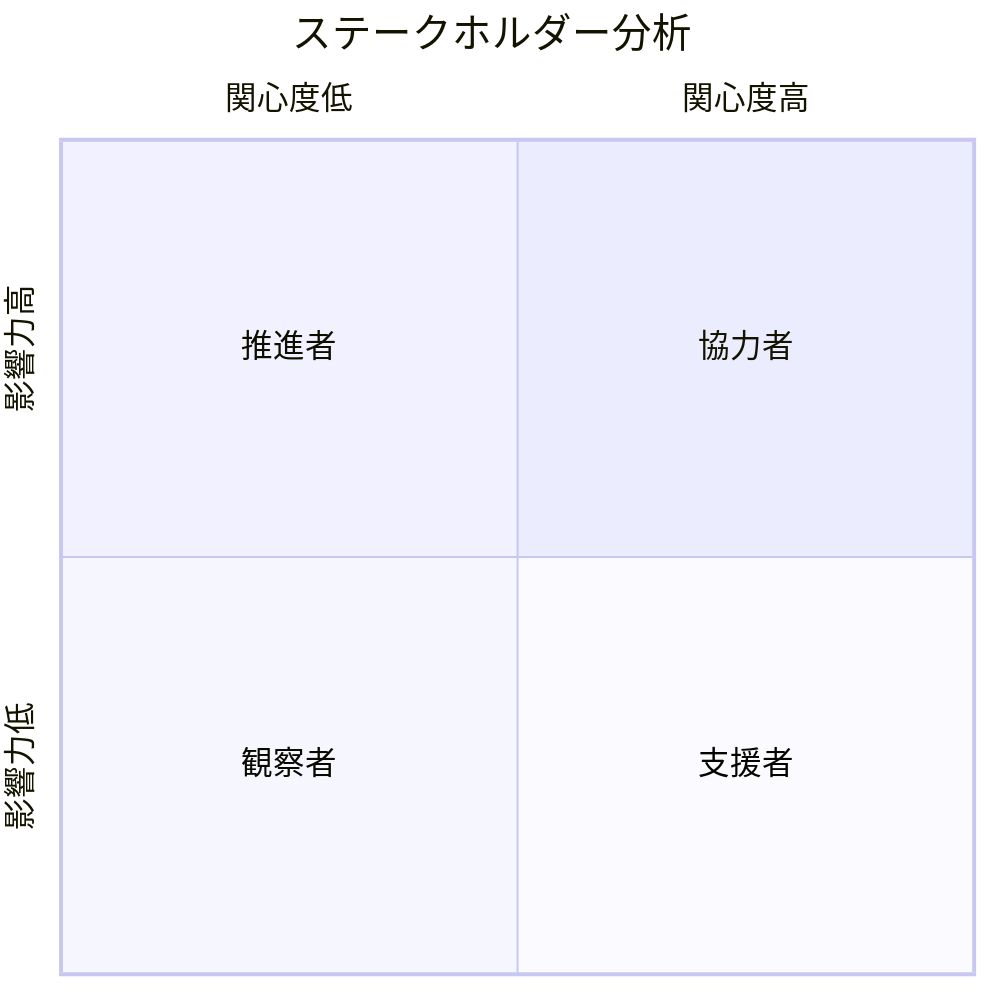
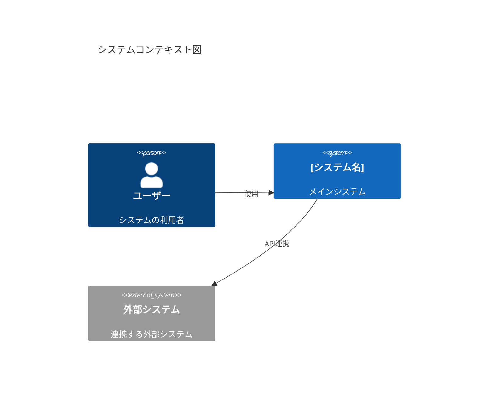
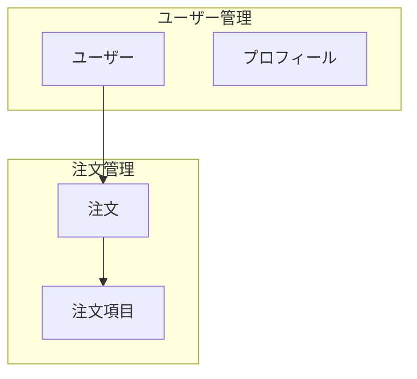

## 📋 **ドキュメント化戦略**

### 🎯 **目的と成果物**
- **新規参画者**: 48時間以内にプロジェクト全体を理解可能
- **既存メンバー**: 最新の仕様・構成を常に参照可能
- **ステークホルダー**: ビジネス価値と技術的進捗を可視化

### 🗣️ **コミュニケーション原則**
- **言語**: 日本語基本、技術用語は英日適切に使い分け
- **精度**: 不明点は必ず確認、推測での記述は禁止
- **更新**: 変更時は即座にドキュメント更新、週次レビュー実施

---

## 🔍 **分析・ドキュメント化プロセス**

### **Phase 1: 現状把握（優先度: 最高）**
1. **既存ドキュメント監査**
   - 📄 成果物: ドキュメント棚卸し表
   - 🎯 品質基準: 全ドキュメントの最終更新日・責任者を特定

### **Phase 2: アーキテクチャ分析（優先度: 高）**
2. **システム全体像**
   - 📄 成果物: C4モデル図（Context→Container→Component）
   - 🎯 品質基準: ステークホルダーが理解可能なレベル

3. **ドメイン分析**
   - 📄 成果物: ドメインモデル図、境界コンテキスト図
   - 🎯 品質基準: ビジネス用語と技術用語の対応表付き

4. **データフロー分析**
   - 📄 成果物: データフロー図、ER図、データ辞書
   - 🎯 品質基準: 個人情報・機密データの分類明記

### **Phase 3: 実装詳細（優先度: 中）**
5. **API仕様**
   - 📄 成果物: OpenAPI仕様書、シーケンス図
   - 🎯 品質基準: 実際のコードと100%同期

6. **ビジネスロジック**
   - 📄 成果物: フローチャート、決定表
   - 🎯 品質基準: 複雑度7以上の処理は必須図解

### **Phase 4: 運用・保守（優先度: 中）**
7. **インフラ構成**
   - 📄 成果物: インフラ構成図、リソース一覧
   - 🎯 品質基準: 障害時の影響範囲を明記

8. **CI/CD パイプライン**
   - 📄 成果物: パイプライン図、デプロイ手順書
   - 🎯 品質基準: 手動実行可能な詳細手順

9. **開発環境構築**
   - 📄 成果物: セットアップガイド、トラブルシューティング
   - 🎯 品質基準: 新規メンバーが30分以内に構築完了

10. **運用・障害対応**
    - 📄 成果物: 運用手順書、障害対応プレイブック
    - 🎯 品質基準: 24/7対応可能な詳細度

---

---

## 📁 **ドキュメントテンプレート体系**

### **標準ディレクトリ構造**
```
docs/
├── 01-overview/                    # プロジェクト概要
│   ├── project-charter.md         # プロジェクト憲章
│   ├── stakeholder-map.md         # ステークホルダーマップ
│   └── glossary.md                # 用語集
├── 02-architecture/               # アーキテクチャ
│   ├── c4-context.md              # C4コンテキスト図
│   ├── c4-container.md            # C4コンテナ図
│   ├── c4-component.md            # C4コンポーネント図
│   ├── domain-model.md            # ドメインモデル
│   └── data-flow.md               # データフロー図
├── 03-api/                        # API仕様
│   ├── openapi.yaml               # OpenAPI仕様
│   ├── sequence-diagrams/         # シーケンス図
│   └── api-changelog.md           # API変更履歴
├── 04-business/                   # ビジネスロジック
│   ├── business-rules.md          # ビジネスルール
│   ├── flowcharts/                # フローチャート
│   └── decision-tables/           # 決定表
├── 05-data/                       # データ設計
│   ├── er-diagram.md              # ER図
│   ├── data-dictionary.md         # データ辞書
│   └── migration-guide.md         # マイグレーションガイド
├── 06-infrastructure/             # インフラ
│   ├── architecture-diagram.md    # インフラ構成図
│   ├── resource-inventory.md      # リソース一覧
│   └── disaster-recovery.md       # 災害復旧計画
├── 07-operations/                 # 運用
│   ├── deployment-guide.md        # デプロイガイド
│   ├── monitoring-guide.md        # 監視ガイド
│   ├── troubleshooting.md         # トラブルシューティング
│   └── runbooks/                  # 運用手順書
├── 08-development/                # 開発
│   ├── setup-guide.md             # 環境構築ガイド
│   ├── coding-standards.md        # コーディング規約
│   ├── testing-strategy.md        # テスト戦略
│   └── ci-cd-guide.md             # CI/CDガイド
└── 99-templates/                  # テンプレート
    ├── adr-template.md            # ADR（Architecture Decision Record）
    ├── rfc-template.md            # RFC（Request for Comments）
    └── incident-report-template.md # インシデントレポート
```

---

## 📋 **フェーズ別テンプレート詳細**

### **Phase 1: プロジェクト概要テンプレート**

#### **1. プロジェクト憲章 (`docs/01-overview/project-charter.md`)**
```markdown
# プロジェクト憲章

## 📋 基本情報
- **プロジェクト名**: [プロジェクト名]
- **開始日**: [YYYY-MM-DD]
- **予定終了日**: [YYYY-MM-DD]
- **プロジェクトマネージャー**: [名前]

## 🎯 目的・目標
### ビジネス目的
- [具体的なビジネス価値]

### 成功指標（KPI）
- [測定可能な指標1]
- [測定可能な指標2]

## 👥 ステークホルダー
| 役割 | 名前 | 責任範囲 | 連絡先 |
|------|------|----------|--------|
| スポンサー | [名前] | [責任] | [連絡先] |
| PO | [名前] | [責任] | [連絡先] |

## 📊 スコープ
### 含まれるもの
- [機能1]
- [機能2]

### 含まれないもの
- [除外項目1]
- [除外項目2]

## ⚠️ リスク・制約
| リスク | 影響度 | 発生確率 | 対策 |
|--------|--------|----------|------|
| [リスク1] | 高/中/低 | 高/中/低 | [対策] |
```

#### **2. ステークホルダーマップ (`docs/01-overview/stakeholder-map.md`)**
```markdown
# ステークホルダーマップ

## 🎯 影響力・関心度マトリクス


## 👥 詳細情報
### 推進者（高影響力・高関心度）
- **[名前]**: [役割・期待・コミュニケーション頻度]

### 協力者（低影響力・高関心度）
- **[名前]**: [役割・期待・コミュニケーション頻度]
```

### **Phase 2: アーキテクチャテンプレート**

#### **3. C4コンテキスト図 (`docs/02-architecture/c4-context.md`)**
```markdown
# C4 コンテキスト図

## 🌐 システムコンテキスト


## 📝 システム概要
- **目的**: [システムの目的]
- **主要機能**: [主要な機能一覧]
- **技術スタック**: [使用技術]

## 🔗 外部システム連携
| システム名 | 連携方式 | データ | 頻度 |
|------------|----------|--------|------|
| [システム1] | REST API | [データ種別] | [頻度] |
```

#### **4. ドメインモデル (`docs/02-architecture/domain-model.md`)**
```markdown
# ドメインモデル

## 🏗️ 境界コンテキスト


## 📚 ドメイン用語集
| 業務用語 | 技術用語 | 定義 |
|----------|----------|------|
| 顧客 | User | システムを利用する個人・法人 |
| 注文 | Order | 商品・サービスの購入依頼 |

## 🔄 ドメインイベント
- **ユーザー登録完了**: 新規ユーザーがアカウント作成時
- **注文確定**: ユーザーが注文を確定時
```

### **Phase 3: API仕様テンプレート**

#### **5. OpenAPI仕様 (`docs/03-api/openapi.yaml`)**
```yaml
openapi: 3.0.3
info:
  title: [API名]
  description: [API説明]
  version: 1.0.0
  contact:
    name: [担当者名]
    email: [連絡先]

servers:
  - url: https://api.example.com/v1
    description: 本番環境
  - url: https://staging-api.example.com/v1
    description: ステージング環境

paths:
  /users:
    get:
      summary: ユーザー一覧取得
      description: システム内の全ユーザーを取得
      parameters:
        - name: limit
          in: query
          schema:
            type: integer
            default: 20
      responses:
        '200':
          description: 成功
          content:
            application/json:
              schema:
                type: object
                properties:
                  users:
                    type: array
                    items:
                      $ref: '#/components/schemas/User'

components:
  schemas:
    User:
      type: object
      required:
        - id
        - name
        - email
      properties:
        id:
          type: integer
          example: 1
        name:
          type: string
          example: "田中太郎"
        email:
          type: string
          format: email
          example: "tanaka@example.com"
```

### **Phase 4: 運用テンプレート**

#### **6. デプロイガイド (`docs/07-operations/deployment-guide.md`)**
```markdown
# デプロイガイド

## 🚀 デプロイフロー


## 📋 デプロイチェックリスト
### 事前準備
- [ ] データベースマイグレーション確認
- [ ] 設定ファイル更新
- [ ] 依存関係更新

### デプロイ実行
- [ ] メンテナンスモード開始
- [ ] アプリケーションデプロイ
- [ ] ヘルスチェック実行
- [ ] メンテナンスモード終了

### 事後確認
- [ ] 主要機能動作確認
- [ ] ログ監視
- [ ] パフォーマンス確認

## 🔧 コマンド例
```bash
# ステージングデプロイ
./deploy.sh staging

# 本番デプロイ
./deploy.sh production

# ロールバック
./rollback.sh [version]
```

## 📞 緊急連絡先
- **技術責任者**: [名前] - [連絡先]
- **運用責任者**: [名前] - [連絡先]
```

---

## ✅ **品質管理・継続改善**

### **テンプレート品質基準**
- **完全性**: 全必要項目をカバー
- **一貫性**: プロジェクト間で統一されたフォーマット
- **実用性**: 実際の作業で即座に使用可能
- **保守性**: 簡単に更新・カスタマイズ可能

### **テンプレート管理プロセス**
- **バージョン管理**: テンプレートの変更履歴を管理
- **フィードバック収集**: プロジェクトからの改善提案を収集
- **定期更新**: 四半期ごとのテンプレート見直し
- **ベストプラクティス共有**: 成功事例の横展開

### **導入支援体制**
- **テンプレート管理者**: 全社テンプレートの統括責任者
- **プロジェクト支援**: 新規プロジェクトへの導入支援
- **トレーニング**: テンプレート活用方法の教育


