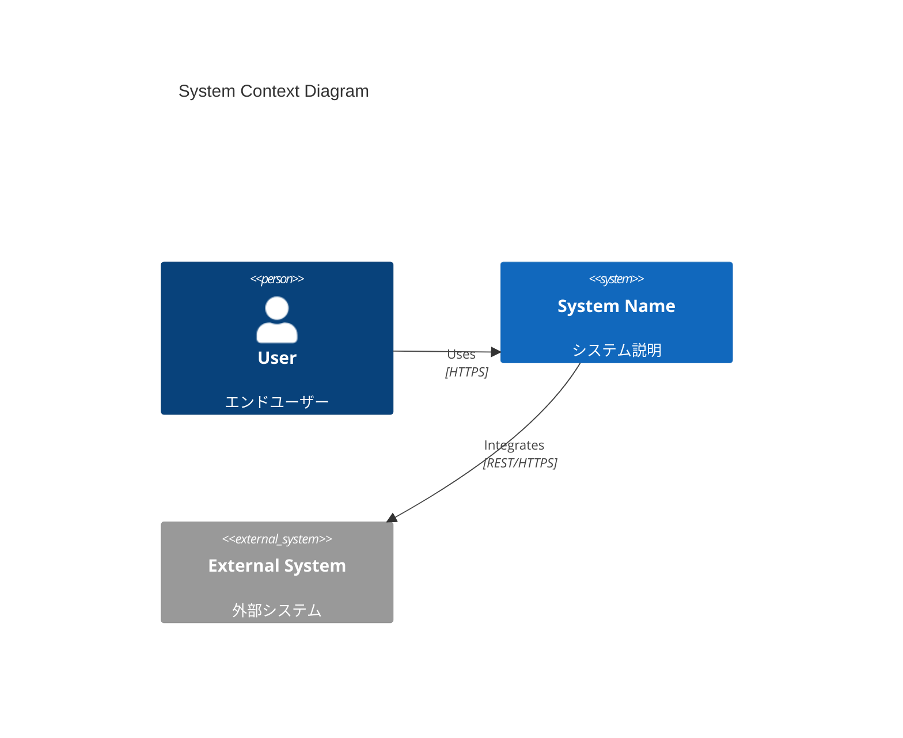
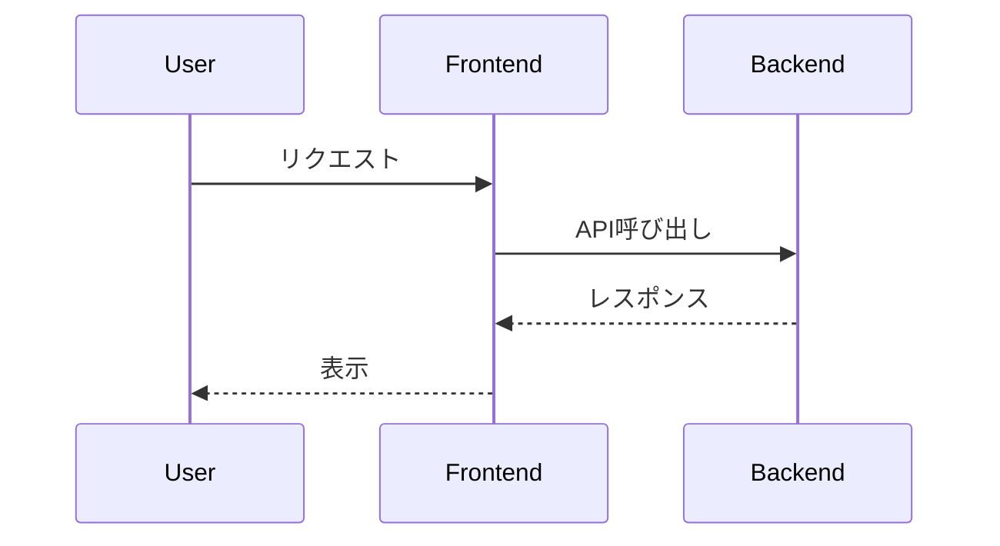
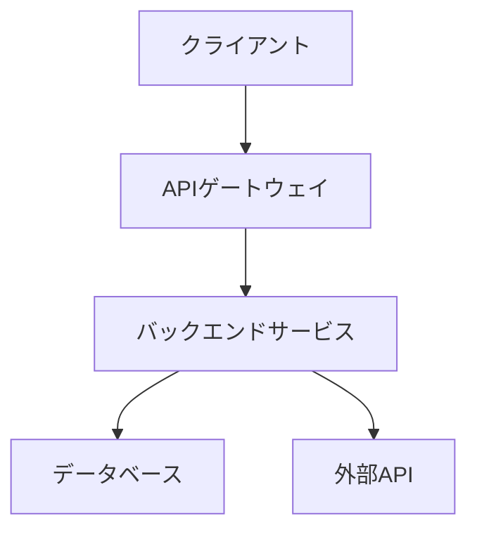
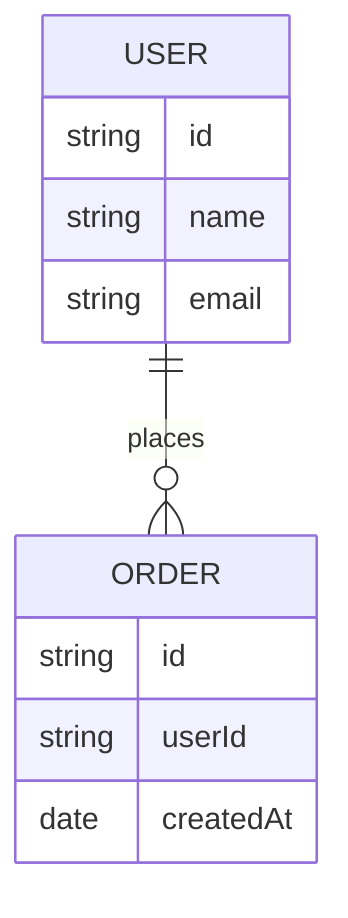
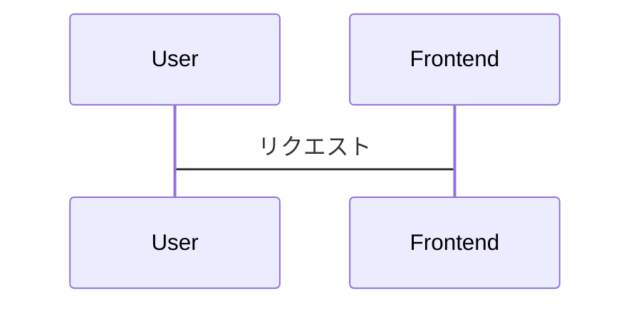
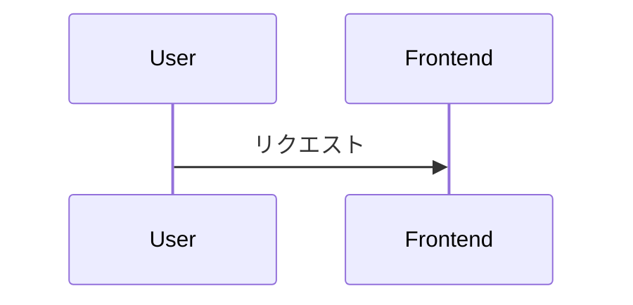
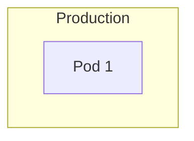
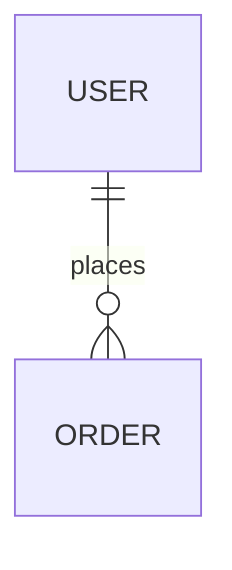

# Mermaid Validator スキル

## 目的

Mermaid図の構文エラーを検出し、自動修正を行うことで、ドキュメント生成時のパースエラーを防止する。

## 対象ファイル

### 自動検証対象

- `docs/**/architecture.md`
- `docs/**/design.md`
- `docs/**/sequence.md`
- `*.md` (Mermaid図を含むすべてのMarkdownファイル)

### 主な検証ポイント

1. **構文エラー検出**
   - 未閉じの括弧、引用符
   - 無効なキーワード
   - インデントの問題

2. **C4モデル構文検証**
   - `C4Context`, `C4Container`, `C4Component` の正しい使用
   - `Person()`, `System()`, `Rel()` の引数チェック

3. **シーケンス図検証**
   - `participant` 宣言の確認
   - 矢印記法（`->>`, `-->>`, `->>`）の正しい使用

4. **グラフ構文検証**
   - ノード定義の正しい記法
   - サブグラフの構文チェック

## Mermaid構文クイックリファレンス

### C4モデル



**注意点**:
- `C4Context` の後に改行が必要
- `title` は必須ではないが推奨
- `Rel()` の引数は必ず4つ（from, to, label, technology）

### シーケンス図



**注意点**:
- `participant` 宣言は必須ではないが推奨
- `->>`（同期）、`-->>`（非同期）、`-x`（破棄）を区別
- ラベルに日本語を含む場合、引用符は不要

### グラフ（フローチャート）



**注意点**:
- `graph TB`（上から下）、`graph LR`（左から右）
- ノードラベルに日本語を含む場合、`[]` で囲む
- `subgraph` はインデント必須

### ER図



**注意点**:
- リレーションシップ記法: `||--o{`（1対多）、`}o--o{`（多対多）
- フィールド定義は `type name` の順

## 検証方法

### オンライン検証（推奨）

```bash
# Mermaid Live Editorで検証
# https://mermaid.live/

# または、mermaid-cliを使用
npx @mermaid-js/mermaid-cli mmdc -i diagram.mmd -o diagram.svg
```

### 手動検証

```bash
# Markdownファイル内のMermaid図を抽出
grep -A 50 '```mermaid' architecture.md > extracted-diagrams.txt

# 構文エラーを目視確認
cat extracted-diagrams.txt
```

## よくある構文エラーと修正方法

### エラー1: C4モデルでタイトルが不正

**誤り**:
```mermaid
C4Context
title: System Context Diagram
```

**修正**:
```mermaid
C4Context
    title System Context Diagram
```

### エラー2: シーケンス図で矢印記法が不正

**誤り**:


**修正**:


### エラー3: グラフでサブグラフのインデント不足

**誤り**:


**修正**:


### エラー4: ER図でリレーションシップ記法が不正

**誤り**:
```mermaid
erDiagram
    USER -> ORDER : places
```

**修正**:


## 自動修正ルール

### ルール1: インデント正規化

- C4モデルの要素をインデント
- サブグラフをインデント
- ERDのフィールド定義をインデント

### ルール2: 引用符の補完

- 特殊文字を含むラベルに引用符を追加
- ただし、日本語のみの場合は不要

### ルール3: 矢印記法の統一

- シーケンス図で `->>` に統一（同期呼び出し）
- 非同期の場合は `-->>` を使用

## CI/CDへの組み込み

### GitHub Actions 例

```yaml
name: Mermaid Validation

on:
  pull_request:
    paths:
      - 'docs/**/*.md'
      - '**/*.md'

jobs:
  validate-mermaid:
    runs-on: ubuntu-latest
    steps:
      - uses: actions/checkout@v2

      - name: Setup Node.js
        uses: actions/setup-node@v2
        with:
          node-version: '20'

      - name: Validate Mermaid Diagrams
        run: |
          npm install -g @mermaid-js/mermaid-cli
          find . -name "*.md" -exec sh -c '
            grep -l "```mermaid" "$1" && {
              echo "Validating $1"
              mmdc -i "$1" -o /tmp/test.svg || exit 1
            }
          ' _ {} \;
```

## 参考資料

- [Mermaid公式ドキュメント](https://mermaid.js.org/)
- [Mermaid Live Editor](https://mermaid.live/)
- [C4モデルガイド](https://c4model.com/)
- [Mermaid CLI](https://github.com/mermaid-js/mermaid-cli)
